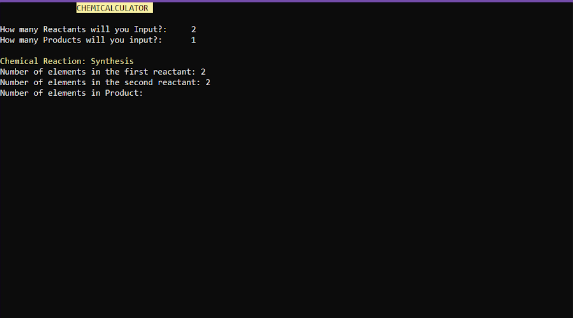
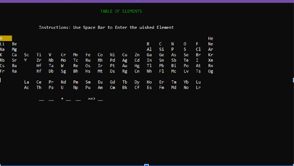
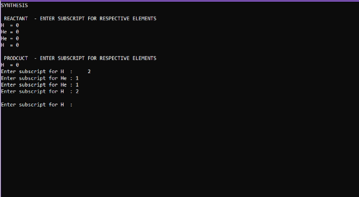

# Chemicalculator
A console-based application for balancing and calculating chemical equations. The application is written in C++ as a project during our first year of my bachelor's degree in Computer Science at Batangas State University. The application is stil not well polished and still contains many bugs (The stable version is still not yet recovered).

## Features
- Balancing of chemical equations
- Navigating through the CLI using arrow keys 

## Preview

